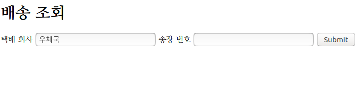
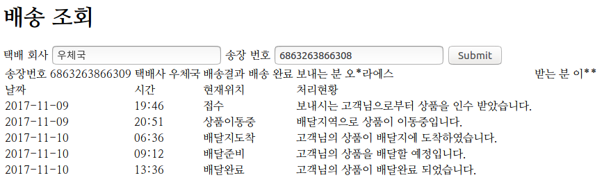

# DeliveryTracking [](https://travis-ci.org/so3500/DeliveryTrackingPublic)

### Develop environment & prerequisites

* Ubuntu 16.04 LTS
* backend - Spring-boot
* frontend - html, jquery.js

### Overview

택배 회사에서 제공하는 배송 정보를 송장 번호를 이용하여 수집 후 보여준다.

안정적인 서비스 제공을 위해 올바르지 않은 입력(송장 번호)에 대한 예외처리를 client, server에서 모두 수행하였음.

작성한 코드 중 일부(배송 조회 request에 대한 처리)가 잘 작동하는지를 junit을 이용하여 테스트







### How To install & run

```sh
cd dt-server
# 서버 시작
./mvnw spring-boot:run

# 배포
./mvnw package
cd target
java -jar dt-server-0.0.1-SNAPSHOT.jar
```


### 구현 사항

##### 기본 구현 사항

송장 번호가 주어질때 배송 내역을 택배 회사 홈페이지로부터 수집하여 보여준다.

URL 정보

* GET: localhost:8080 - index.html
* GET: localhost:8080/delivery-tracking - 배송내역 조회

##### 구현 중점 사항

예외 처리: client, server에서 모두 처리 

* 주어진 송장 번호의 길이(우체국 택배의 경우 13자리)
* 주어진 송장 번호의 양식(숫자로 이루어진 문자열 여부)

예외 처리: server에서 처리 

* 올바른 양식의 송장 번호일 경우라도 배송 내이 있는지 
* 올바른 양식의 송장 번호이고, 배송 내역도 존재하는지 아닌지

테스트(junit): server에서 처리 

* 올바른 길이, 양식의 송장 번호와 그렇지 않은 송장 번호에 대한 테스트를 DeliveryControllerTest 클래스에서 처리
* 13자리 송장 번호와 13자리가 아닌 송장 번호를 무작위로 생성하여 테스트에 활용하였음 


### 추가 구현 및 프로젝트 관리 아이디어

1. 배송 중인 물품 추적
   * LINE chat bot 활용
   * 배송 중인 물품에 대해 변경상항이 발생할 때마다 사용자의 메신저로 알림
   * 사용자가 서비스를 편하게 이용할 수 있도록 함
2. Jenkins, Travis  CI(Continuous Integration) Tool 적용
   * 프로젝트 자동 빌드 (및 배포)를 통해 개발한 코드가 실제 서버에 올라갔을 경우에도 작동하는지를 확인할 수 있음
   * 프로젝트의 완성도를 높일 수 있으며, 관리가 쉬움.

